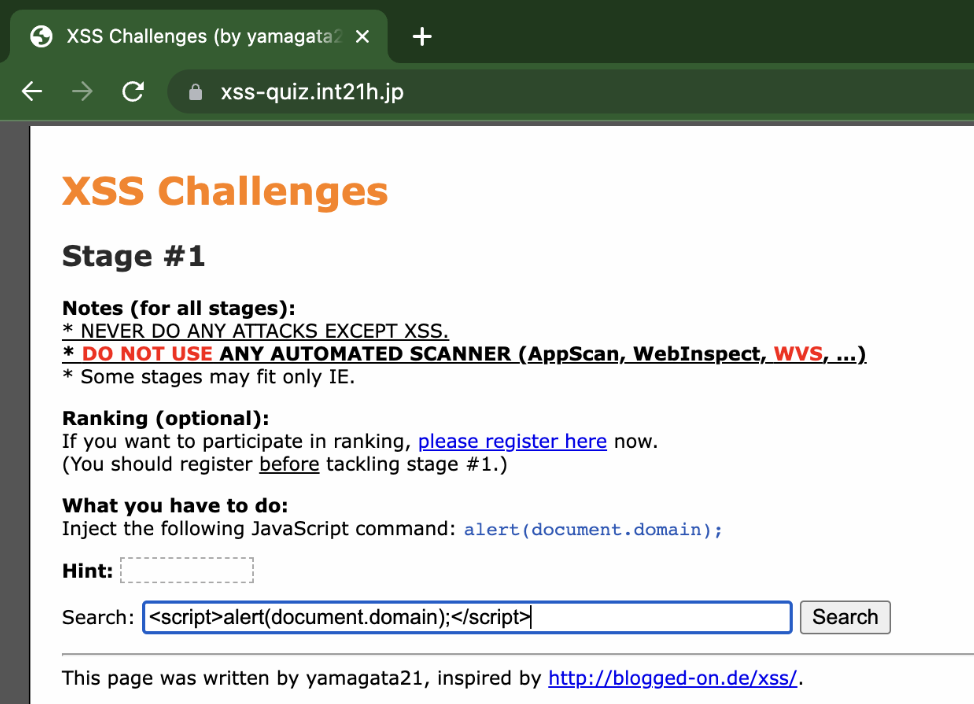
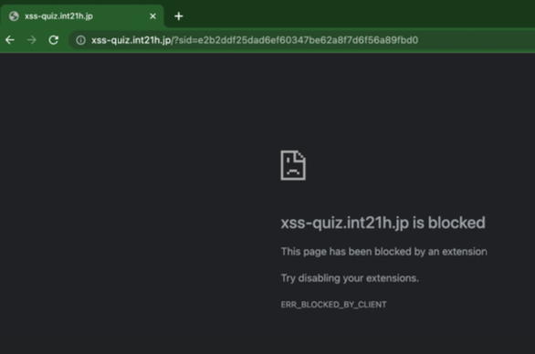
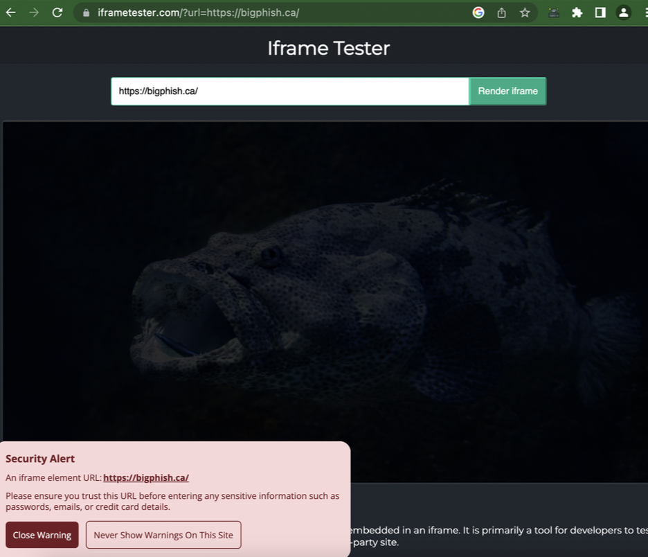
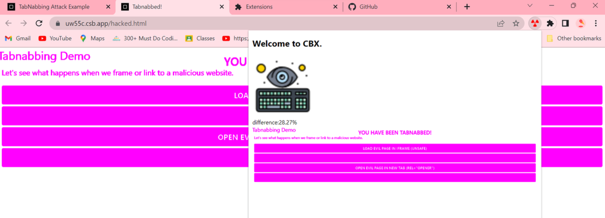
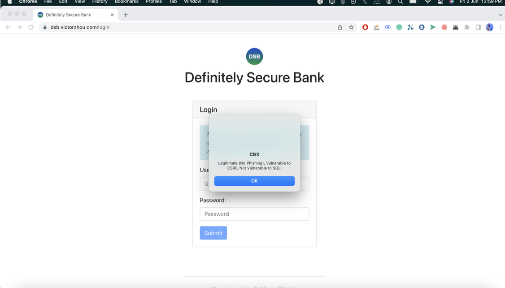

# 🛡️ CBX: A Cross Browser Extension to Detect Multiple Web Attacks

[](LICENSE)
[](https://ieeexplore.ieee.org/document/10306729)

CBX is a comprehensive security-focused browser extension designed to detect and mitigate common web-based attacks in real-time. Built to be compatible across Chromium-based browsers, it empowers users and organizations with proactive protection against web vulnerabilities like XSS, CSRF, SQLi, and more.

---

## 📌 Features

- 🔐 Detects multiple web vulnerabilities:
  - Cross-Site Scripting (XSS)
  - Cross-Site Request Forgery (CSRF)
  - SQL Injection (SQLi)
  - Tabnabbing
  - Phishing
  - Frame Busting (iFrame-based attacks)
- 🧠 ML-based phishing detection (trained on PhishTank dataset)
- 🌍 Cross-browser compatibility: Chrome, Edge, Opera, Brave
- ⚡ Lightweight with minimal performance overhead
- 🔄 Real-time detection and alerts

---

## 📚 Research Backing

This extension is backed by academic research and was published at IEEE:

> 📄 **A Survey Paper on Browser Extensions to Detect Web Attack**  
> [IEEE Xplore](https://ieeexplore.ieee.org/document/10306729)

---

## 🛠️ Technologies Used

- HTML5, CSS3, JavaScript (Vanilla)
- Chrome Extension APIs (Manifest v3)
- Machine Learning (Phishing Detection)
- Static + Behavioral Analysis
- Browser DOM & Event Listeners
- Secure Local Storage
- VirusTotal API (for Phishing analysis)

---

## 🚀 Getting Started

### 1. Clone the Repository

```bash
git clone https://github.com/your-username/CBX-Browser-Extension.git
cd CBX-Browser-Extension
```

### 2. Load the Extension

To load the extension in your browser:

#### For Chrome, Brave, or Edge:

1. Open your browser and go to `chrome://extensions/`
2. Enable **Developer mode** (toggle in the top-right corner)
3. Click **Load unpacked**
4. Browse and select the root directory of this project (where `manifest.json` is located)

---

## 📸 Screenshots

> Replace these with actual image paths or URLs once available

### XSS



### iFrame


### Tabnabbing


### Phishing, CSRF, SQLi


---

## 📈 Results & Evaluation

CBX was tested against simulated environments and real phishing datasets. Detection accuracy highlights:

- XSS Detection: ~93%
- SQL Injection: ~91%
- Phishing Detection (ML-based): ~96%
- Tabnabbing & Clickjacking: Rule-based detection with >90% efficacy

Details are available in the full report.

---

## 🧪 Testing Tools Used

- **Ghost Inspector**: For automated UI testing
- **Selenium IDE**: For interaction flow testing
- **LambdaTest**: Cross-browser testing automation

---

## 🧩 Limitations

- Some false positives in edge cases (especially with aggressive input sanitization)
- Resource usage may spike on content-heavy pages
- Not compatible with all manifest versions (tested on Manifest v3)
- Currently supports Chromium-based browsers only

---

## 📅 Future Scope

- Threat intelligence feed integration (VirusTotal, URLScan)
- Enhanced UI and centralized dashboard
- Custom rule configuration per organization

---

## 👨‍💻 Contributors

- Sahethi Depuru Guru 
- Ayush Pattnaik  
- Rutuja Kolte  
- Nikhil Sharma  

> Under the guidance of **Prof. Varshapriya J. N.**, VJTI Mumbai

---

## 📄 License

This project is licensed under the MIT License.  
See [`LICENSE.md`](LICENSE.md) for details.


